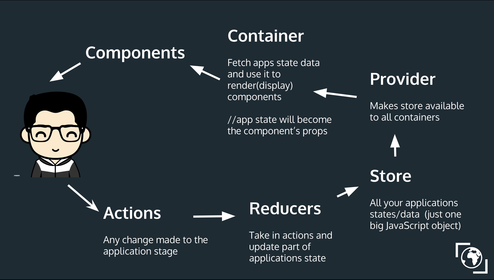

import { Head, Image } from 'mdx-deck'
export { default as theme } from './theme'

# Redux


state management for react
---

# Initial State

Let's say you have an peach. You initial state of the peach is
```javascript
const initialPeach = {
  dirty: true, 
  remainingBites: 5, 
  color: 'orange',
};

```

---
# Actions
You can do things to the peach with actions, so we want to define the actions. 

```javascript
const WASH = {type: 'WASH'};
const EAT = {type: 'EAT', bites: 2};
const ROT = {type: 'ROT'};
```
---
# Reducers

When an action is dispacthed, the reducer is called. 

The reducer gets the previous state and the action, and the reducer function defines how to create the new state

```javascript 
function peachReducer(state = initialPeach, action) {
  switch(action.type) {
    case 'WASH':
      return {...state, dirty: false};
    case 'EAT':
      return {
        ...state,
        remainingBites: Math.max(0, state.remainingBites - action.bites)
      };
    case 'ROT':
      return {...state, color: 'brown'};
    default:
      return state;
  }
}

```

---


# Store

We also want to put this into a universal store. 
```javascript 

const store = Redux.createStore(peachReducer, initialPeach);
```

And we can use ```store.getState()```  to get a json object with the stat eof the current object. 


```javascript
function handleChange() {
  const currentPeachState = store.getState();
  if (currentPeachState.color === 'orange') {
    console.log("Let's eat it");
  } else {
    console.log("Let's throw it out");
  }
}
store.subscribe(handleChange);
```


---

# Containers

We want to pass in the necessary actions and state from the redux store intio the components


```javascript
import React from 'react';
import { connect } from 'react-redux';
import { bindActionCreators } from 'redux';
import Peach from "./../components/Peach"
import { washPeach, eatPeach, rotPeach } from './../actions';

const mapDispatchToProps = (dispatch) => bindActionCreators({
    washPeach,
    eatPeach,
    rotPeach,
}, dispatch);


const mapStateToProps = (state) => ({
    dirty: state.peach.dirty,
    remainingBites: state.peach.remainingBites,
    color: state.peach.color
});


export default connect(mapStateToProps, mapDispatchToProps)(Peach);
```


---

# Components 

You components can be passed in all relevant information from state and the relevant actions, abstracting away that logic. 


```javascript
import React from 'react';
import { washPeach, eatPeach, rotPeach } from './../actions';
import { bindActionCreators } from 'redux';

const Peach = ({ washPeach, eatPeach, rotPeach, dirty, remainingBites, color  }) => (
    <div>
        <p>Dirty: {dirty ? 'true' : 'false'}</p>
        <p>Remaining bites: {remainingBites}</p>
        <p>Color: {color}</p>

        <button onClick={washPeach}>Wash peach</button>
        <button onClick={eatPeach}>Eat peach</button>
        <button onClick={rotPeach}>Rot peach</button>
    </div>
);

export default Peach
```


---

# Let's put it all together

---



---
# Why is it important?

---

# What are Pure Functions?

 * Given the same values it returns the same things
 * No side effects (mutation of local variables or anything else)

---

Redux does this through reducers, which are passed in a current state and an action and return a new state. 

This means the old state is never mutated 

Isolates all state changes and gives only the necessary actions and state variables to a component

---

# When is it used?

---

* State Management get's complicated as the app scales

* Caching page state by maintaining a seperate store


---

# Thanks for watching :) 